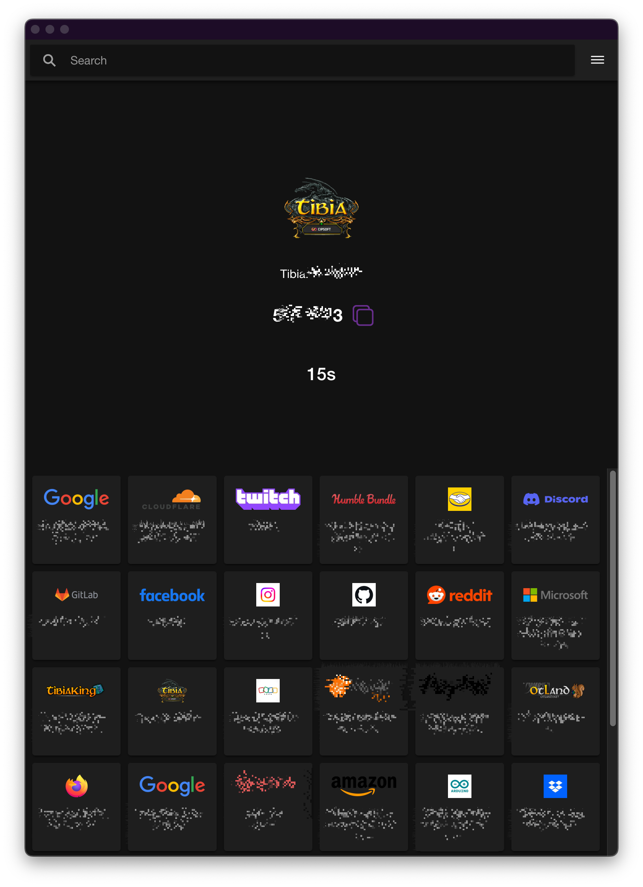

# AuthLeu
An open source, Self-hosted synced or fully offline alternative to Twilio's Authy (but can also substitute Google Authenticator, Microsoft authenticator and other TOTP 2FA Apps). 

If you want, you may sync your 2FA tokens and have your own URL using Firebase Firestore and Firebase Hosting with your google account.

## Current and Planned Features
- [x] Add 2FA accounts by scanning QR code or manually entering the secret key and account details.
- [ ] Edit 2FA account details.
- [ ] Delete/disable/hide 2FA accounts.
- [x] Sync 2FA accounts across multiple devices using Firebase Firestore.
- [ ] Sync 2FA accounts across multiple devices using an exported file.
- [ ] Encrypt 2FA Secrets in the local storage using a master password.
- [ ] Encrypt 2FA Secrets in the firestore using a master password. 
- [ ] Support for other 2FA methods like HOTP.

## Screenshots
### Portrait layout

### Landscape layout
 