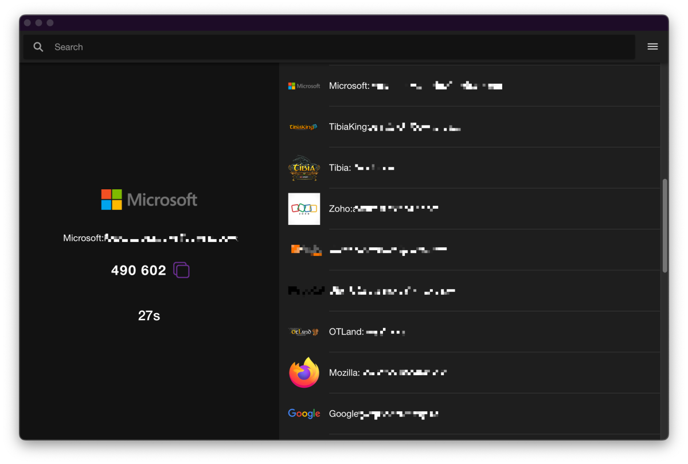

# AuthLeu
  
An open-source, self-hosted alternative to Twilio's Authy, capable of syncing or operating fully offline. It can also serve as a substitute for TOTP 2FA apps like Google Authenticator and Microsoft Authenticator.

If preferred, you can synchronize your 2FA tokens and have your own URL using Firebase Firestore and Firebase Hosting with your Google account.

## Current and Planned Features
- [x] Progressive Web App (PWA) support.
- [x] Add 2FA accounts by scanning QR code or manually entering the secret key and account details.
- [ ] Edit 2FA account details.
- [ ] Delete/disable/hide 2FA accounts.
- [x] Sync 2FA accounts across multiple devices using Firebase Firestore.
- [x] Import/Export 2FA accounts as a JSON file.
    - [ ] Import/Export only selected 2FA accounts.
- [ ] Encrypt 2FA Secrets in the local storage using a master password.
- [ ] Encrypt 2FA Secrets in the firestore using a master password. 
- [ ] Support for other 2FA methods like HOTP.
- [x] Internationalization
    - [x] English
    - [x] Portuguese (Brazil)
    - [ ] Other languages support (HELP WANTED)
- [x] Dark mode support.

## Screenshots
### Portrait layout

### Landscape layout
 